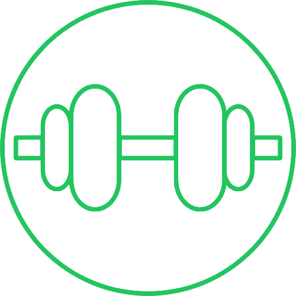

# Fitt-with-Pitt
## Health and Fitness Tracking Application

<br>
CS1530 Software Engineering - Group 8 Fitness & Wellness

## Highlights

- Exercise, nutrition, and body weight tracking
- Goal setting and tracking
- Data visualization of your progress
- Secure user data

## Overview

This is the project repository for the Spring 2026 CS1530 Software Engineering Group 8 final project. Our software follows a fitness and wellness topic, building a tracking application to support users' health and fitness goals. Users can track exercise progress, weight loss/gain, and nutritional goals such as desired protein intake. All of this is supported with data visualization to help show your progress and keep you motivated on your journey.

### Software Specifications

The tech stack used includes:

**Front End:**
- Vanilla CSS/HTML
- JavaScript for visualization graphs via Chart.js

**Back End:**
- Flask framework (Python)

**Database:**
- SQLite

### Authors

Project Created By:
- Jagger Hershey
- Wyatt McMullen
- Mason Zhang
- Ismail Miloua
- Nate Ippolito

### Self-Hosting

1. Clone or fork this repository
2. Install dependencies:
   ```bash
   pip install -r requirements.txt
   ```
3. Create a `.env` file in the project root with the following:
   ```
   SECRET_KEY=your-generated-key
   MAIL_API_KEY=mailboxlayer-api-key
   MAIL_AUTH_KEY=brevo-api-key
   ```
4. Run the application:
   ```bash
   flask --app app --debug run
   ```
